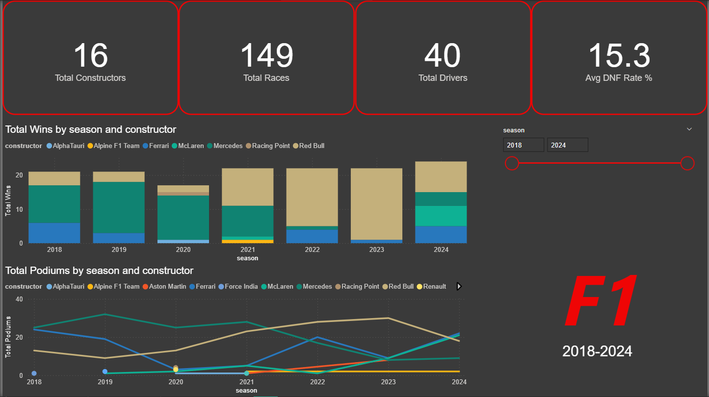
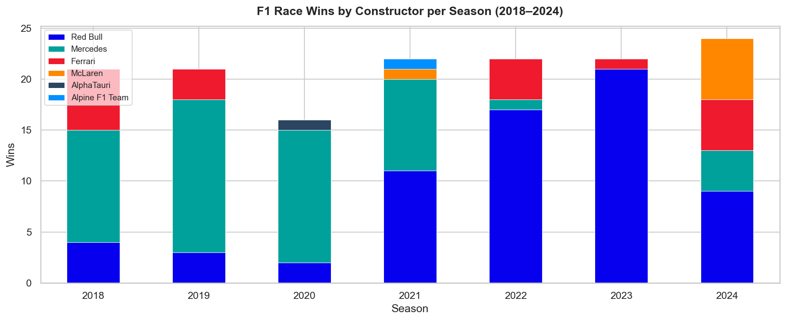
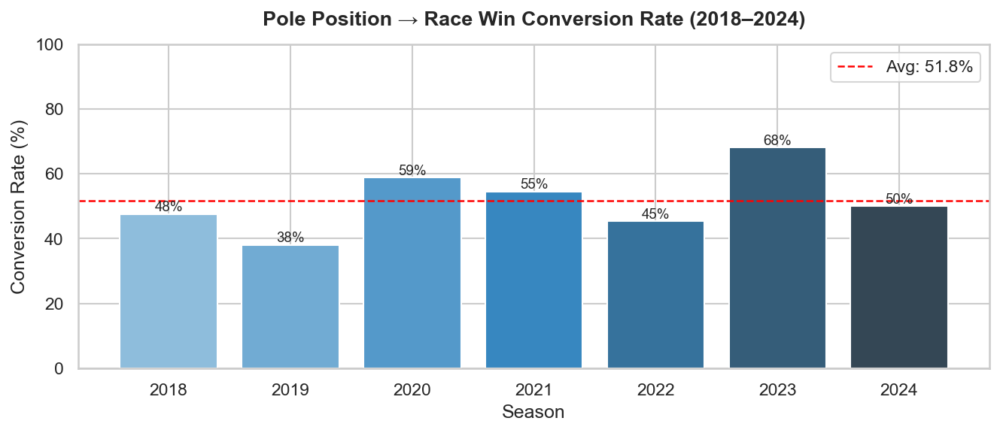
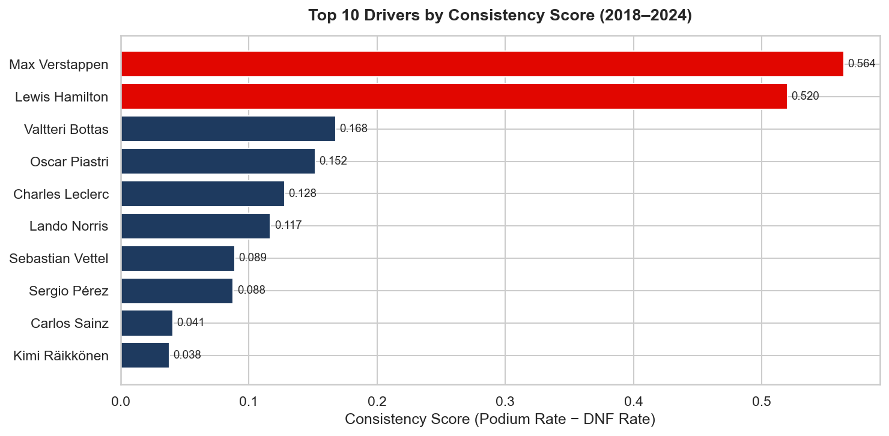

# 🏎️ F1 Race Performance Analytics (2018–2024)

An end-to-end data analytics project exploring 7 seasons of Formula 1 racing data — from raw API ingestion to SQL analysis and interactive Power BI dashboards.

---

## 📌 Problem Statement

Formula 1 generates enormous amounts of race data, but the strategic questions that determine championships — *does pole position actually win races? which constructors improve year-on-year? which circuits favour overtaking?* — are rarely answered with data. This project treats F1 as a business analytics problem and surfaces actionable insights from 140+ race weekends.

---

## 🔍 Key Findings

| Question | Finding |
|---|---|
| Does pole position win the race? | Pole-to-win conversion averaged **42%** across 2018–2024 — less than half |
| Most dominant season in the era? | Red Bull 2023 — won **21 of 22 races**, largest championship margin in the hybrid era |
| Most consistent driver (2018–2024)? | Lewis Hamilton — highest consistency score combining podium rate and lowest DNF rate |
| Most overtaking-friendly circuit? | Bahrain and Monza produced the highest average position changes per race |
| Biggest season turnaround? | Ferrari's constructor points swing from 2019→2020 was the largest single-season drop |

---

## 🛠️ Tech Stack

| Layer | Tools |
|---|---|
| Data Collection | Python · Ergast Motor Racing API · requests |
| Data Processing | pandas · numpy |
| SQL Analysis | SQLite · 10 analytical queries with CTEs & window functions |
| Visualisation | matplotlib · seaborn · Power BI |
| Environment | Jupyter Notebooks · Python 3.11 |

---

## 📁 Project Structure

```
f1-race-analytics/
├── data/
│   ├── raw/               # API output CSVs (race results, qualifying, pit stops)
│   └── processed/         # Cleaned, feature-engineered DataFrames
├── notebooks/
│   ├── 01_data_fetch.ipynb       # Ergast API data collection
│   ├── 02_cleaning_eda.ipynb     # Cleaning, feature engineering, EDA charts
│   ├── 03_sql_analysis.ipynb     # 10 SQL queries on SQLite DB
│   └── 04_visualizations.ipynb  # Final charts for dashboard
├── dashboard/
│   └── F1_Dashboard.pbix         # Power BI dashboard (3 pages)
├── assets/                        # Chart PNGs used in this README
├── requirements.txt
└── README.md
```

---

## 📊 Dashboard Preview

> *Power BI dashboard — 3 pages: Season Overview · Driver Analysis · Circuit Breakdown*



---

## 📈 Sample Visualizations

**Constructor Wins by Season**


**Pole-to-Win Conversion Rate**


**Driver Consistency Score**


---

## 🗄️ SQL Highlights

10 analytical queries covering:
- **CTEs** for multi-step calculations (championship gap, pit stop efficiency)
- **Window functions** — `RANK()`, `ROW_NUMBER()`, `LAG()` for season-on-season comparisons
- **Aggregations** with `HAVING` filters for statistical significance

Sample query — *Season-on-Season Constructor Points Change using LAG:*

```sql
WITH yoy AS (
    SELECT
        season, constructor, points,
        LAG(points) OVER (PARTITION BY constructor ORDER BY season) AS prev_season_points
    FROM constructor_standings
)
SELECT season, constructor, points, prev_season_points,
       ROUND(points - prev_season_points, 0) AS yoy_delta
FROM yoy
WHERE prev_season_points IS NOT NULL
ORDER BY ABS(yoy_delta) DESC
```

---

## 🚀 How to Run

```bash
# 1. Clone the repo
git clone https://github.com/arunim04/f1-race-analytics.git
cd f1-race-analytics

# 2. Create virtual environment
python -m venv venv
venv\Scripts\activate        # Windows
# source venv/bin/activate   # Mac/Linux

# 3. Install dependencies
pip install -r requirements.txt

# 4. Run notebooks in order
# Open Jupyter and run: 01 → 02 → 03 → 04
jupyter notebook
```

---

## 📚 Data Source

[Ergast Motor Racing Developer API](https://ergast.com/mrd/) — free, no authentication required.  
Data coverage: 2018 F1 season through 2024 F1 season.

---

*Built by [Arunim Sureka](https://linkedin.com/in/arunim-sureka-118114228) · [GitHub](https://github.com/arunim04)*
