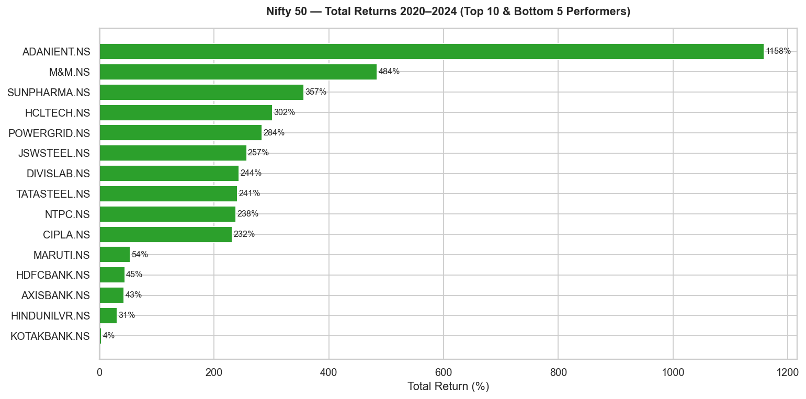
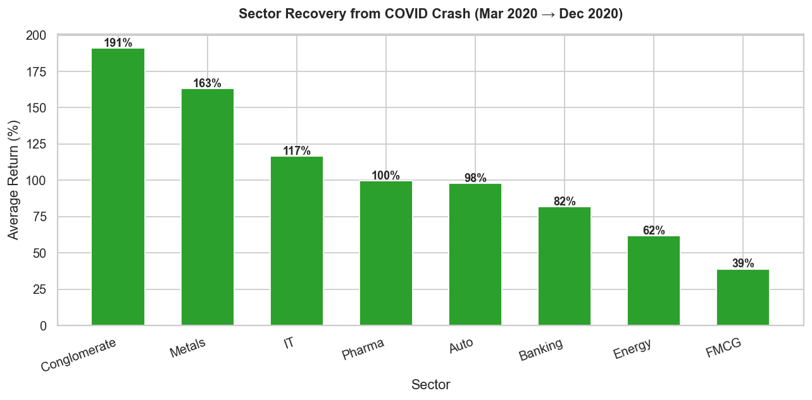
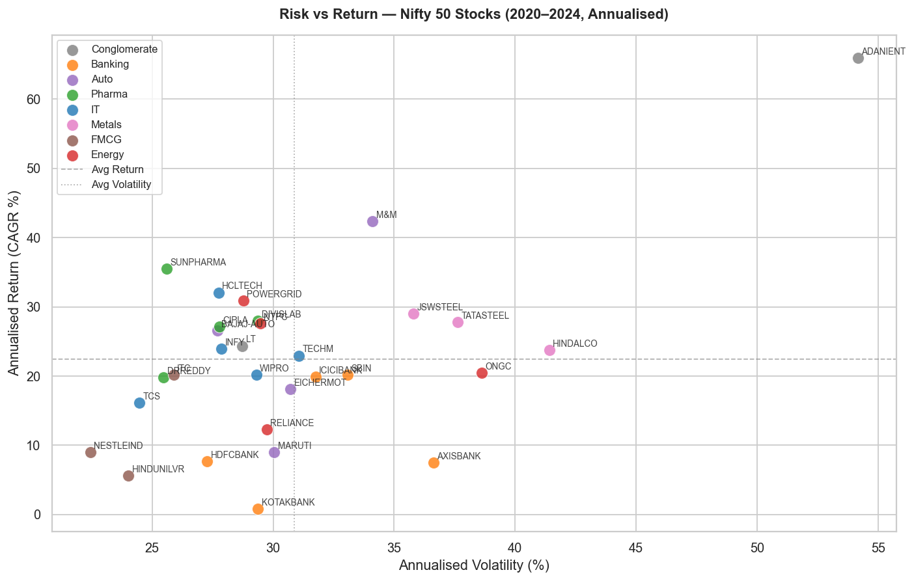
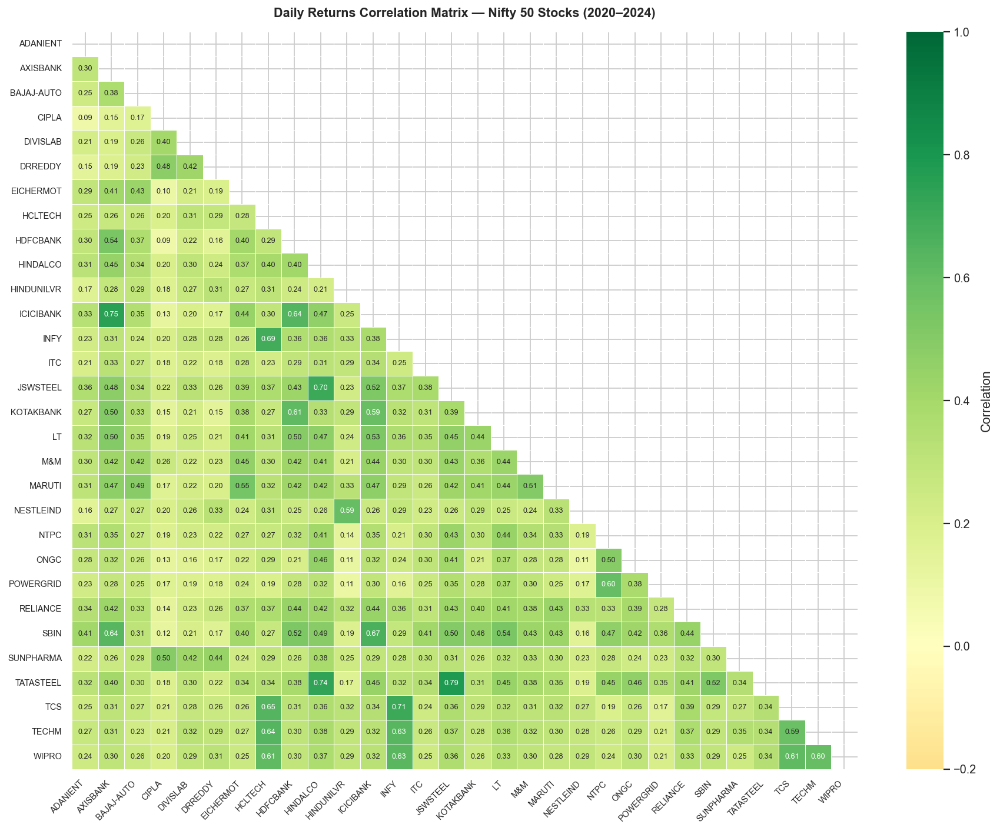
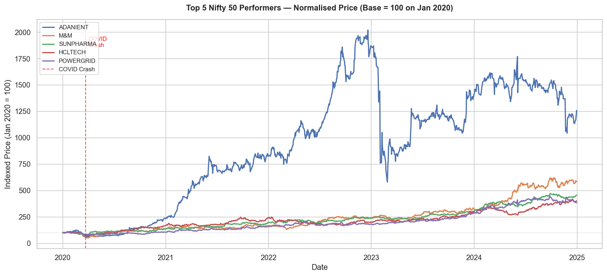
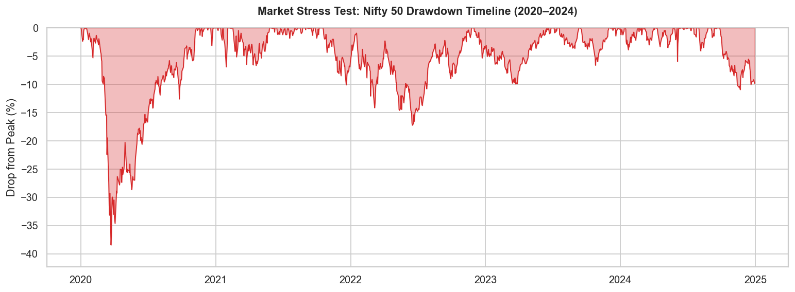
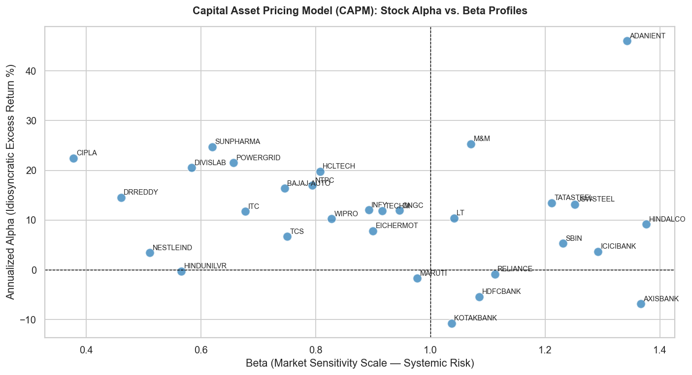
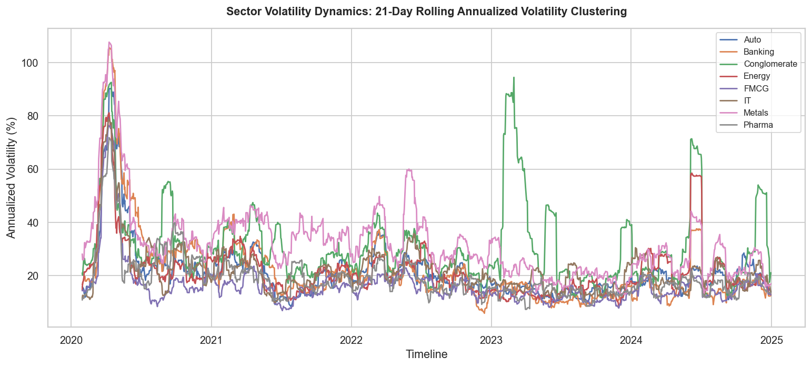

# 📈 Nifty 50 Stock Market Analysis (2020–2024)

An exploratory data analysis of 30 Nifty 50 stocks across 5 years — covering COVID recovery, sector performance, risk-return tradeoffs, and stock correlations.

---

## 📌 Problem Statement

The Indian stock market went through one of its sharpest crashes in March 2020, followed by an unprecedented bull run. This project answers: *which sectors recovered fastest, which stocks delivered the best risk-adjusted returns, and how correlated are stocks within the same sector?*

---

## 🔍 Key Findings

| Question | Finding |
|---|---|
| Best 5-year performer? | ADANIENT delivered the highest total return (2020–2024) |
| Fastest COVID recovery sector? | Conglomerate recovered 191% within 9 months of the crash |
| Highest risk stock? | ADANIENT — highest annualised volatility |
| Most correlated sector? | Banking stocks move most closely together (avg correlation > 0.8) |
| Average market return? | Nifty 50 stocks averaged 208% total return over 5 years |
| Least Risky Sector? | FMCG showed lowest volatility |

> 📝 CAPM Distribution: Used linear regression (y = mx + c) for each stock against the Nifty 50 index to isolate Alpha ($\alpha$) and Beta ($\beta$)values and map them onto a four-quadrant scatter grid
* Beta ($\beta$): Measures how sensitive a stock is to the overall market (Beta = 1 means it moves exactly with the market).
* Alpha ($\alpha$): Measures the excess return a stock generated purely due to its own company strength, independent of market movements.

---

## 🛠️ Tech Stack

| Layer | Tools |
|---|---|
| Data Collection | Python · yfinance (Yahoo Finance API) |
| Analysis | pandas · numpy |
| Visualisation | matplotlib · seaborn |
| Environment | Jupyter Notebook · Python 3.11 |

---

## 📁 Project Structure

```
nifty50-analysis/
├── notebooks/
│   └── nifty50_analysis.ipynb   # Complete analysis — single notebook
├── assets/
│   ├── 01_total_returns.png            # Top & bottom performers bar chart
│   ├── 02_covid_recovery.png           # Sector recovery from March 2020 crash
│   ├── 03_risk_return.png              # Risk vs return scatter by sector
│   ├── 04_correlation_heatmap.png      # Daily returns correlation matrix
│   ├── 05_top5_performance.png         # Normalised price performance (base 100)
│   ├── 06_market_drawdown.png          # Nifty 50 market drawdown
│   ├── 07_alpha_beta_frontier.png      # CAPM alpha, beta for each stock
│   └── 08_volatility_clustering.png    # Sector volatility clustering
├── requirements.txt
└── README.md
```

---

## 📊 Visualizations

**Total Returns 2020–2024**


**COVID Recovery by Sector**


**Risk vs Return Scatter**


**Correlation Heatmap**


**Top 5 Performers — Normalised Price**


**Market Drawdown**


**CAPM Alpha, Beta**


**Sector Volatility Clustering**



---

## 🚀 How to Run

```bash
git clone https://github.com/arunim04/nifty50-analysis.git
cd nifty50-analysis
python -m venv venv
venv\Scripts\activate
pip install -r requirements.txt
jupyter notebook
```

Open `notebooks/nifty50_analysis.ipynb` and run all cells top to bottom.

---

## 📚 Data Source

[Yahoo Finance](https://finance.yahoo.com/) via the `yfinance` Python library — free, no authentication required. All tickers use `.NS` suffix for NSE-listed stocks.

---

*Built by [Arunim Sureka](https://linkedin.com/in/arunim-sureka-118114228) · [GitHub](https://github.com/arunim04)*